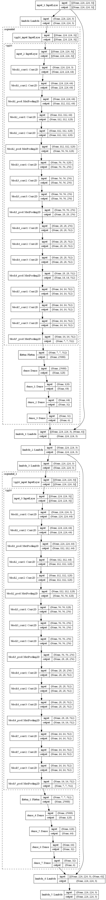
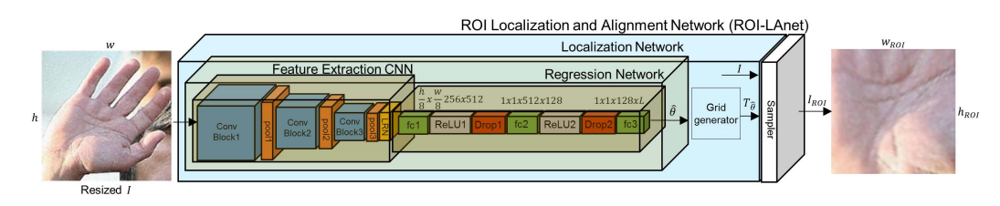
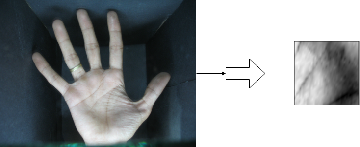
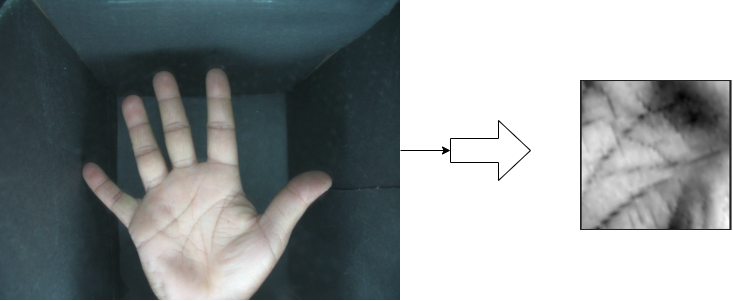
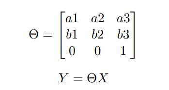
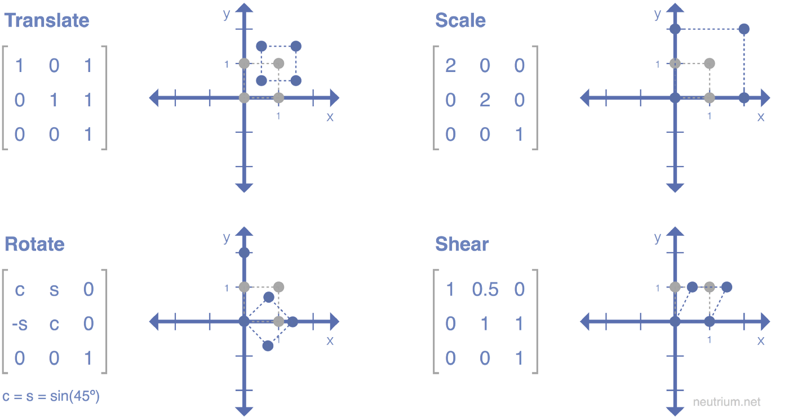

# Palmprint-recognition
Uses Spatial transformation networks to process palmprint images and train Deep neural network for person identification .
Packages used ----
 - Tensorflow
 - Numpy

Uses the following architecture for Palmprint ROI extraction :

The code implements the following pictorial representation :
  

Some examples of ROI extraction by the trained network are :
  and     

The system works by using VGG-16 net to generate the parameters of the affine transformation matrix given below : 

  

 This helps in different kinds of transformations like translation , scaling , rotations , bending etc . 
 
  

This helps in extracting information containing person identity which can be used to compare and differentiate between people .
